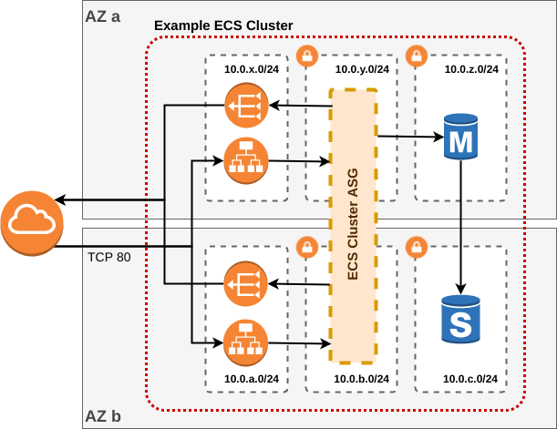

# Technical Challenge Platform CI/CD + EKS infrastructure

This repository uses Terraform and Chef to quickly create a Jenkins instance and two EKS clusters optimized for rapid prototype development in AWS. The jenkins instance acts as both the CI/CD facilitator as well as the bastion to access instances within the VPC.


Each environment (development and production) is a standalone EKS cluster. Each cluster is split across multiple availability zones with the EC2 instances residing in private subnets. A single postgres RDS instance (with multi-az enabled) is provisioned for each cluster, each application is expected to create the databases it needs within the given instance. A single ALB is created for all ingress traffic into the cluster (it is depicted in the figure as two ALBs since it is redundant across AZs), furthermore a NAT Gateway is provided for each EKS cluster to allow internet connectivity for EC2 cluster instances. Note: if you need more environments and are running up against EIP account limits, then the reduntant NAT Gateway in each cluster can be safely removed.



Upon running terraform to create the infrastructure in this repository, several AWS SSM key-value parameters will be available for reference in the CI/CD pipeline (e.g. deployment region, cluster names, ALB listener references, etc). Furthermore each application pipeline will need to coordinate resource creation/usage with what has been provided in this repository. Below is an example of such coordination:


First the `tcp-eks` pipeline should be run to create any globally used resources (such as docker images). In the example case above, ECR repositories are created as well as SSM paramters for later use by the application pipelines, followed by building and publishing the "base" and "pipeline" docker images to ECR.

*What are these docker images?* The "base" image is what the application production docker image will be derived from. The "pipeline" image is used within the application pipeline to test and build the application. (It is assumed that any toolchains necessary to build and test an application will be containerized for speed and portability. In this way if a toolchain changes it will not require that Jenkins be reprovisoned, but instead, simply rebuilding the toolchain image in question.)

Once the `tcp-eks` pipeline completes successfully, then application pipelines can begin to run. In the example above a `react` application is being tested, built, and deployed. The application pipeline in this example is using terraform to create and manage the EKS service, ECR repository (for the application production image), ALB Target changes (for facilitating routing), and persisting important key-value parameters in SSM. All terraform state is persisted to an S3 bucket and read/write coordination is achieved by locking on a dynamoDB table during any terraform action --this ensures that parallel pipeline runs are not mutating shared state simultaneously.

Lastly, jenkins has resource locks for each environment to ensure that multiple applications are not attempting to modify the same environment at the same time. During any deployment the application pipeline should acquire an environment resource lock before attempting to deploy any application and release this lock after the deployment has finished.


## Prerequisites

Edit the file localy called `aws/terraform.tfvars` with the following contents:

```
# Change these
account_id = "090999229429"
aws_access_key = "your access key"
aws_secret_key = "your secret key"
aws_email = "your email address"

# Amazon EKS is available in the following Regions at this time:
# US West (Oregon) (us-west-2)
# US East (N. Virginia) (us-east-1)
# EU (Ireland) (eu-west-1)
aws_region = "us-west-2"

# only alpha-numeric and dashes allowed!
project_name = "something-unique"
environment = "development"

# no single quotes allowed
jenkins_developer_password = "a good password"

# no single quotes allowed
jenkins_admin_password = "a really good password"

# the user must have access to the repos that should be under ci/cd control
github_user = "your user"

# the token should have FULL repo access and FULL admin:web_hook access
github_token = "your token"

# these need to be unique per region and per environment
bastion_key_name = "bastion_ENVIRONMENT_ssh_key_pair_YOURNAME"
jenkins_key_name = "jenkins_ENVIRONMENT_ssh_key_pair_YOURNAME"
cluster_key_name = "cluster_ENVIRONMENT_ssh_key_pair_YOURNAME"

# credentials used to create any application database
# password must be greater than 8 characters
db_username = "tcp-eks"
db_password = "anothergreatpassword"
db_identifier = "pg-tcp-eks-db1"

# Leave these alone
github_repo_owner = "excellaco"
github_repo_include = "tcp-eks tcp-angular tcp-java"
```

This is used by both of the jenkins and eks terraform modules.

[Generate Github token](https://help.github.com/articles/creating-a-personal-access-token-for-the-command-line/) follow instructions here to generate a personal access token. Be sure to include scope for "repo" and "admin:repo_hook", otherwise your token will not allow you to scan the organization for exisiting repositories.

## Build container

docker build -t tcp-eks:latest -f Docker/Dockerfile .

## Run container

docker run -it tcp-eks:latest

## Provisioning Jenkins + Dev/Prod EKS Clusters

Head into the infrastructure toolchain container:
```
glue bash tcp-eks
```

To generate keys and provision the Jenkins infrastructure run the following from within the toolchain container:

```
./run.sh all
```

As you modify terraform code, replan and apply the changes as needed:

```
./run.sh plan
./run.sh apply
```

To destroy all created resources, run:

```
./run.sh destroy
```
